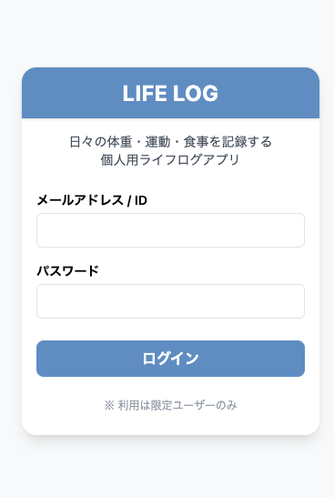
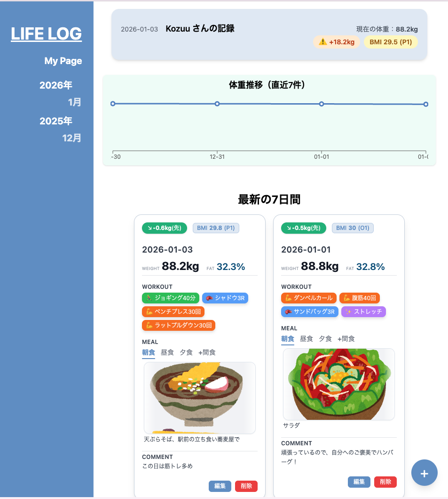
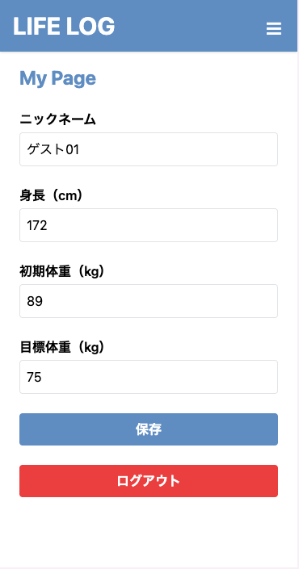

# Life Log App

**Life Log App** は、  
体重・運動・食事（画像）を日次で記録できる  
**React + TypeScript + Supabase 製のライフログ SPA**です。

フロントエンド開発の学習を目的としつつ、  
**実運用を意識した設計・型安全・責務分離・CRUD 実装**を重視して段階的に開発しています。

---

## 📌 プロジェクトの目的

- React / TypeScript を用いた SPA 開発の実践
- UI / Form / State / API / DB の責務分離
- 実務を意識したフォーム設計・バリデーション設計
- Supabase を用いた Auth / Database / Storage の統合

---

## Step 1：HTML + CSS + JavaScript（基礎構築）

- HTML+CSS+JS で画面を構成
- `localStorage` にログデータを保存
- DOM 操作・イベント処理の基礎
- ログ一覧・編集・削除の実装
- デザインはプレーン CSS ベース

---

## Step 2：Tailwind CSS + TypeScript（リファクタリング）

- Tailwind CSS によるデザイン統一
- TypeScript による型安全化・構造整理
- `utils/`・`types/` モジュール分割
- カード編集/削除ボタン実装(CRUD 完成)
- 画像は Base64 形式で localStorage に保存

---

## Step 3：React + TypeScript（SPA 化）

- React によるコンポーネント設計
- react-router-dom によるページ遷移
- Zustand による状態管理
- Page / Component の責務整理

---

## Step 4：Supabase（Auth / DB / RLS / Storage）

- Supabase Auth による認証（限定アカウント運用）
- Supabase Database によるログ永続化
- Supabase Storage による食事画像アップロード
- RLS（Row Level Security）設定
- API 層の分離と設計整理
- Add / Edit 共通フォームの完成
- バリデーション導入による堅牢化
- Add / Edit / Home すべてで操作結果を toast 表示

---

## Tech Stack

- Frontend: React + TypeScript + Vite
  - 型安全と高速な開発体験を重視
- State Management: Zustand
  - グローバル状態をシンプルに管理
- Backend: Supabase
  - Auth / Database / Storage を統合的に利用
  - Row Level Security によりユーザー単位でデータを分離
- Routing: react-router-dom
- Styling: Tailwind CSS
- Validation: Zod v4

---

## 📸 主な機能

- [x] ログ一覧表示（Supabase DB）
- [x] 新規ログ作成（体重・運動・食事・コメント）
- [x] 編集機能（既存データ反映）
- [x] 削除機能（確認ダイアログ付き）
- [x] 食事画像アップロード（Supabase Storage）
- [x] 画像差し替え時の旧画像削除
- [x] 入力バリデーション（Zod）
- [x] Supabase Auth + RLS による限定ユーザー運用

---

## Architecture / Design

- Form と Page の責務分離（LogForm / AddLog / EditLog）
- API 層分離（lib/api）
- Zustand によるログ状態管理
- Supabase RLS による認可制御

#### LogForm

- 入力 UI と state 管理に専念
- DB / Storage / Auth / Routing を一切知らない
- Zod による入力バリデーションを内包
- Add / Edit 両方で共通利用される純粋なフォームコンポーネント

#### AddLog

- 新規作成ユースケースを担当
- DB insert 後、Zustand の state を再同期

#### EditLog

- 編集・削除ユースケースを担当
- DB update / delete 後、Zustand の state を再同期

---

### State Management（Zustand）

- 一覧データは `useLogs` ストアで一元管理
- API 層は純粋な通信処理に限定
- 追加・編集・削除後は `loadLogs()` により再同期
- 画面遷移後も即時反映される構成

---

### Validation 設計

- Zod v4 を使用
- `safeParse` による submit 前検証
- `treeifyError` を util 化し、フォーム用エラー形式へ変換
- フィールド単位でエラーメッセージ表示

---

### Authentication / User Roles

本アプリでは Supabase Auth を利用し、以下のユーザー区分を設けています。

### 管理者アカウント

- プロフィール（身長・目標体重など）の編集が可能
- 全ログの作成・編集・削除が可能

### ゲストアカウント（体験用）

- ログの作成・編集・削除が可能
- プロフィールは read-only
- 初回ログイン時にサンプルプロフィールが自動設定されます

ゲストアカウントはアプリの利用感を確認するための体験用として用意しています。
この構成により、管理者は実運用に近い利用が可能であり、
ゲストユーザーはアプリの操作感を安全に体験できる設計としています。

---

## 🧩 今後の拡張アイデア

- 週・月単位の体重推移グラフ
- UI / UX 改善
- PWA 対応

---

## 📷 Screenshots

### Login

### Home

日次ログをカード形式で一覧表示。編集・削除は即時反映。

### My Page

## 🚀 Demo

https://life-log-app-xxxx.vercel.app

## 🧾 License

MIT License  
© 2025 kosuke homma
